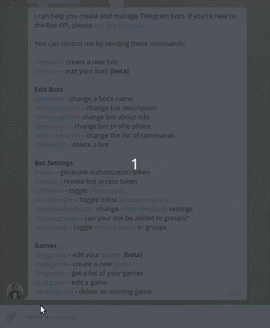
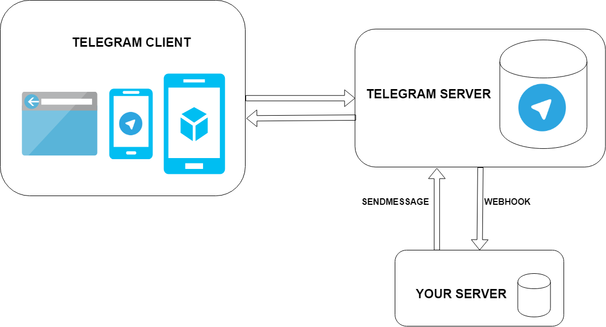
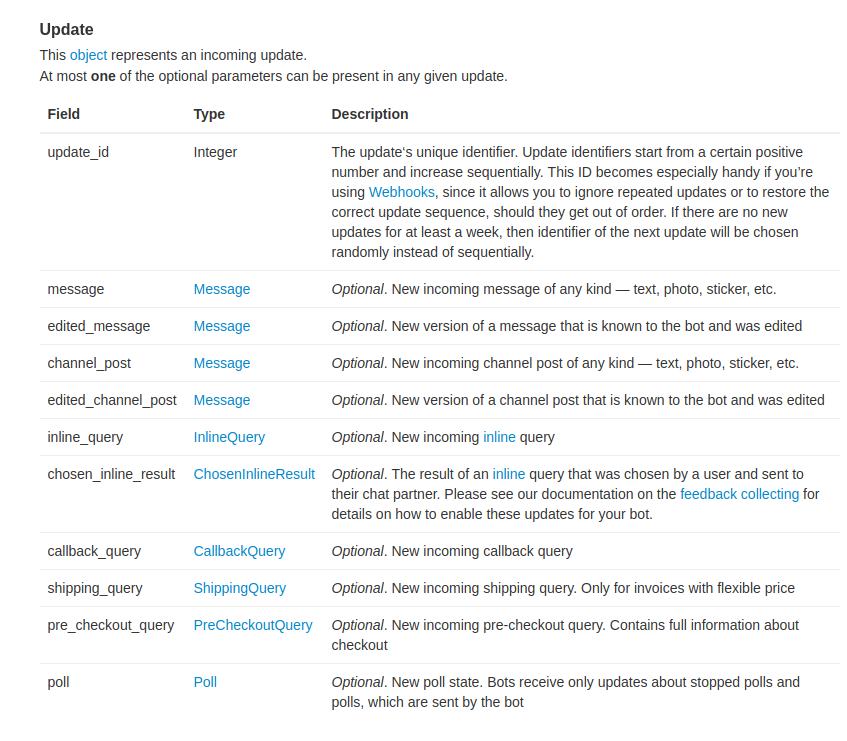
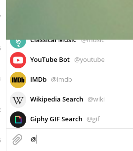
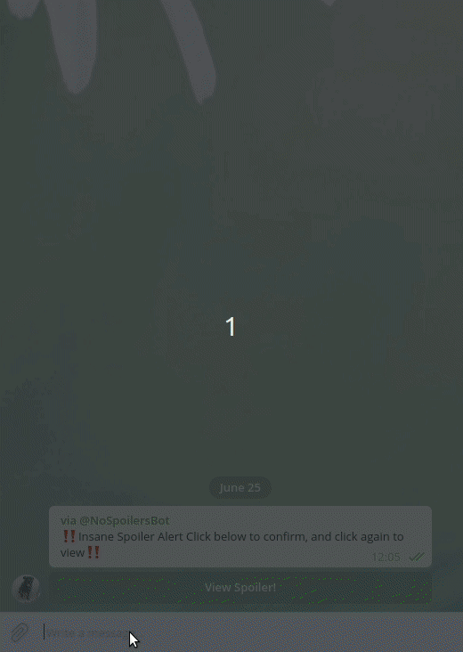
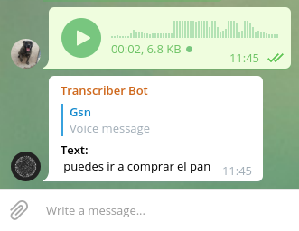
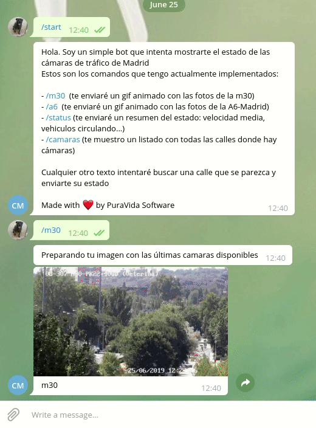

= Groogram
Gerson Cabrera, desarrollador Groovy en b2boost
2019-25-06
:revealjs_slideNumber: true
:icons: font
:toc2: left
:revealjs_theme: league
:source-highlighter: highlightjs
:revealjs_progress: true

//black,white,FAV: league,sky,beige,simple,serif,blood,night,moon,solarized
¡bots de telegram con groovy!

@tf_gerson

[NOTE.speaker]
--
presentarme, trabajo en b2boost, bla bla bla, trabajo con groovy.
Preguntar si alguien no ha usado telegram y que el objetivo es que cualquier pueda hacer un bot de telegram con estas slides
--

== Introducción
* Como crear un bot y configurarlo.
* Arquitectura general del bot y comunicación con nuestra aplicación.
* Ejemplos de código en Groovy.
* Review de bots varios.
* Conclusiones.

[NOTE.speaker]
--
Explicación breve de todo lo que vamos a ver en la charla (TODO: revisar esto después de terminar la charla)
--

[%notitle]
=== Definición de bot

Un bot es un programa informático que ejecuta tareas repetitivas a través de internet

[NOTE.speaker]
--
Esta es una definición formal de bot pero para nosotros como backen devs, los bots suponen acceso a consolas para usar nuestras aplicaciones sin tener que usar un navegador
--

=== Crear bots en Telegram

.@BotFather
image:botfather.jpeg[]

[NOTE.speaker]
--
Para crear bot hay que usar un bot!, esto viene perfecto para ejemplificar cómo son los bots en telegram
--

=== Un bot funciona como un chat cualquiera

[NOTE.speaker]
--
Se puede mandar mensajes al bot, recibirlos etc, no entrar mucho en las configuraciones que se pueden hacer pero acabar comentando la privacidad
--

=== Cuidado con la privacidad cuando uses bots

[NOTE.speaker]
--
no hay bots privados, el bot lee todos tus mensajes, atento a si el bot responde sin comandos
--

=== Arquitectura de un bot

[NOTE.speaker]
--
El cliente puede ser web, smarthpone, table..., tu servidor tiene un endpoint /webhook al que telegram manda updates
--

=== Telegram API

se puede consultar
link:https://core.telegram.org/bots/api[aquí]

https://api.telegram.org/bot<token>/METHOD_NAME
https://api.telegram.org/bot<token>/sendMessage

[NOTE.speaker]
--
No vamos a revisar toda la api pero revisar logs y método para mandar mensajes 
--

=== Conectar el webhook con tu aplicación

[source,http]
----
post/get:
https://api.telegram.org/bot751729:AAFJRaz8sUequ/setWebhook

body: {"url":"www.urlbase.com"}  
----

[NOTE.speaker]
--
Miren que fácil se conecta!!!, ahora vamos a ver como mandar mensajes al bot
--

=== ¡¡Pero dame código!!!

image::mathfin.gif[]

=== Controller

[source,groovy]
----
@Controller
class TelegramController {

    @Inject
    TelegramHandler telegramHandler

    @Post("/webhook")
    void webhook(@Body Update update) {
        telegramHandler.messageReceiver(update)
    }
}
----

[NOTE.speaker]
--
Esta es una aplicación en micronaut, hay que crear un endpoint con el path /webhook y recibe un Update que es la estructura que te manda telegram y veremos más adelante.
--

=== Update model

[caption="update model: ",link=https://core.telegram.org/bots/api#getting-updates]
  

[NOTE.speaker]
--
Contar la estructura por encima, ver lo que te puede enviar telegram y hacer incapie en como se sacan los datos del mensaje y del usuario que lo ha mandado
--

=== Telegram handler
[source,java]
----
@Log
@Singleton
class TelegramHandler {

    @Inject
    MessageService messageService

    private static final def commands = ['start', 'help']

    void messageReceiver(Update params) {
        String message = params?.message?.text?.drop(1)
        log.info("message received $message")
        validateMessage(message)
        "$message"(params)
        // invokeMethod(message, params)
    }

    void validateMessage(String message) {
        if (!(message in commands)) {
            throw new ValidationException("the message is not a valid command")
        }
    }

    void start(Update params) {
        String chatID = params?.message?.getChat()?.getId()
        messageService.sendNotificationToTelegram("HelloWorld", chatID)
    }

    void help(Update params) {
        String chatID = params?.message?.getChat()?.getId()
        messageService.sendNotificationToTelegram("use /start to say hello world!", chatID)
    }
}
----

[NOTE.speaker]
--
control-shift-a Telegram handler, servicio que recibe el mensaje y lo mapea al método que ejecutará la lógica asociada a ese comando, manda una respuesta a
--

=== Message Service
[source,java]
----
@Singleton
class MessageService {

    @Client("https://api.telegram.org/bot848542380:AAEjlY6qaxA0eEFUXoOFDHwAVMI4-91kW28")
    @Inject
    RxHttpClient httpClient
    
    void sendNotificationToTelegram(String message, String chatId) {
        httpClient.toBlocking().exchange("/sendMessage?text=$message&chat_id=$chatId")
    }
}
----

[NOTE.speaker]
--
message service, se encarga de mandar mensajes a telegram. Comentar que el token del bot debería ir en una variable de entorno en una aplicación seria
--

=== Problemas que me he encontrado

[NOTE.speaker]
--
Vamos a comentar problemas que he sufrido haciendo bots para que ustedes no tengan que quedarse como en el gif.
--

[%notitle]
=== Problemas que me he encontrado

1. Logs y gestión de errores (Telegram reenvía por defecto los mensajes erróneos)
2. Tienes que hablar al bot para que pueda hablarte
3. Jerarquía de bots
4. Tiempo de respuesta de tu servidor
5. Funcionalidades complejas resultan frustrantes para usuarios no técnicos

[NOTE.speaker]
--
Vamos a comentar problemas que he sufrido haciendo bots para que ustedes no tengan que quedarse como en el gif.
--

=== Ejemplos de uso

Algunos bots vienen integrados en telegram por defecto, podemos citarlos usando @ como a cualquier otro bot/usuario:

[NOTE.speaker]
--
Con @ podemos citar a bots y usuarios
Vamos a ver varios ejemplos de bots interesantes para hacernos una idea de lo que se puede hacer con bots, queries inline y comentar funciones avanzadas
--

=== Inline queries

[NOTE.speaker]
--
comentar que los updates se pueden recibir de esta manera también y configurar lo que mandamos a telegram
--

[%notitle]

=== auto comandos

Un bot no puede activar comandos pero puede mandar el mensaje con una / como si fuera un link al mismo

[NOTE.speaker]
--
comentar que los updates se pueden recibir de esta manera también y configurar lo que mandamos a telegram
--

=== @transcriber_bot

[NOTE.speaker]
--
Este bot está disponible en multitud de idiomas y devuelve una transcripción de un audio que se ha mandado al grupo
Comentar que también se pueden transcribir imágenes, tiene un /donate a su paypal
--

=== @NoSpoilersBot

[NOTE.speaker]
--
comentar que tiene niveles de spoiler, con HUGE hay que hacer 2 clicks por ejemplo
--

=== @M30Madridbot

[NOTE.speaker]
--
Bot hecho por jorge, puedes solicitar que te mande imágenes de las cámaras de tráfico de Madrid.
--

=== Conclusiones

* Los bots son de gran utilidad para el desarrollador
* Configurar la privacidad
* Hay que tener cuidado con la gestión de errores y la jerarquía
* Potencial ilimitado
* El proceso de creación de bots se puede automatizar fácilmente

[NOTE.speaker]
--
Si hay tiempo, comentar junto al potencial usos chulos como la integración de microsoft con azure, automatización, ifftt.. etc
--

=== Agradecimientos y, ¿Preguntas?

image::bot.png[600,350]

Groogram link:https://github.com/Blazerg2/groogram[Github repo]

[NOTE.speaker]
--
thanks to madrid gug y pura vida software
--

